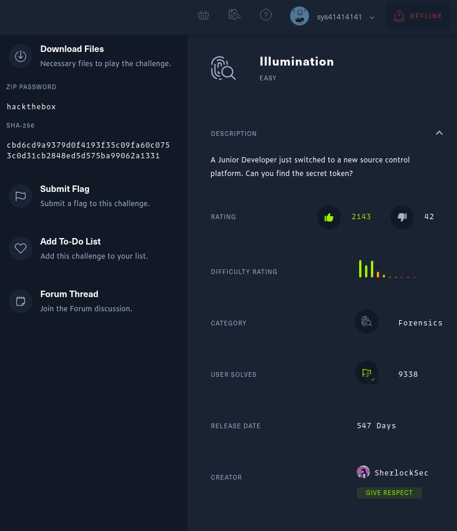
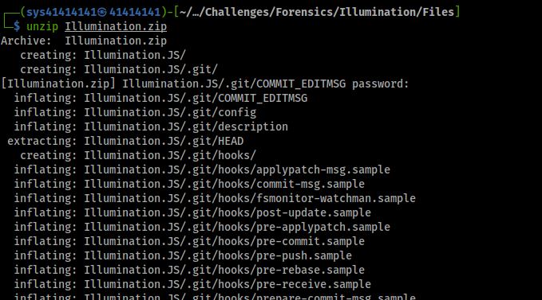
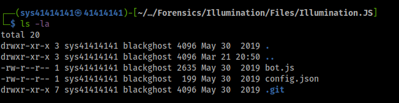
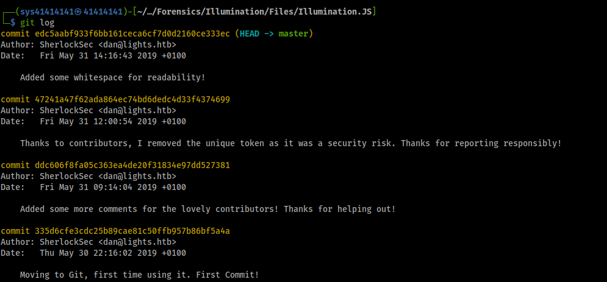
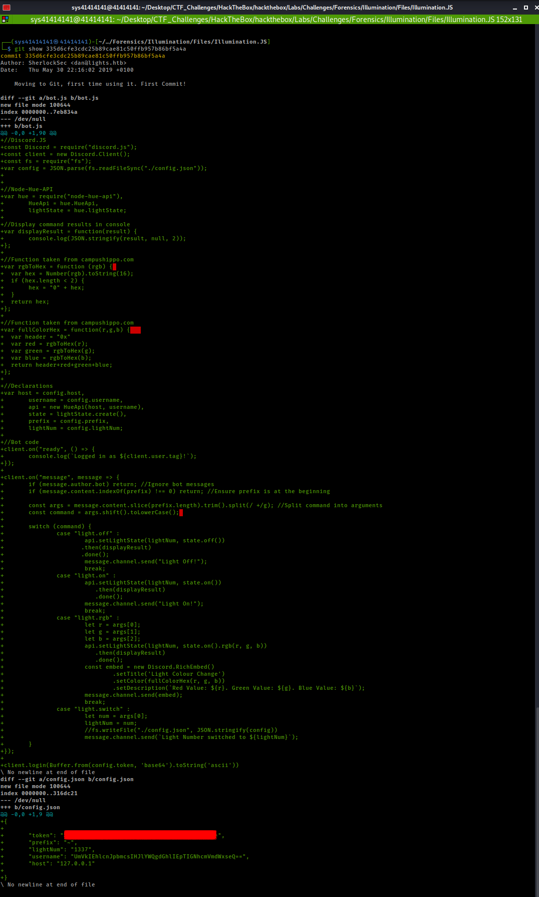
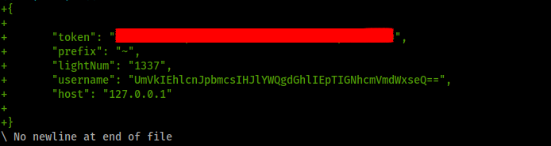
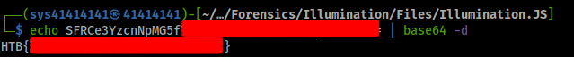

# HackTheBox [LAB-challenge] (Forensics)
## CHALLENGE NAME : Illumination

## Writeup by **`Arijit-Bhowmick`** aka **`sys41414141`**

### Challenge Description

`
A Junior Developer just switched to a new source control platform. Can you find the secret token?
`

## SOLUTION

Download the zip file provide by the challenge.

First of all I unzip the files from zip file using the command `unzip Illumination.zip`

Then I cd into **Illumination.JS** directory as `cd Illumination.JS` and list the files in the directory as  `ls -la`

Here I have seen that the directory contain `.git` folder, which seems that it is a git repository.

Then I have used the command `git log` to view the commit details.

after that I have used `git show 335d6cfe3cdc25b89cae81c50ffb957b86bf5a4a`
to view the, **log message and textual diff** of that commit.

Here we can see the `token` is shown at the end of the file.

Let us decode the `base64` encoding of  the token value.
Here, I have used `echo SFRCe3YzcnNpMG5fYzBudHIwbF9hbV9JX3JpZ2h0P30= | base64 -d` to decode the value.
and this is how I got the **Flag** for this challenge.

