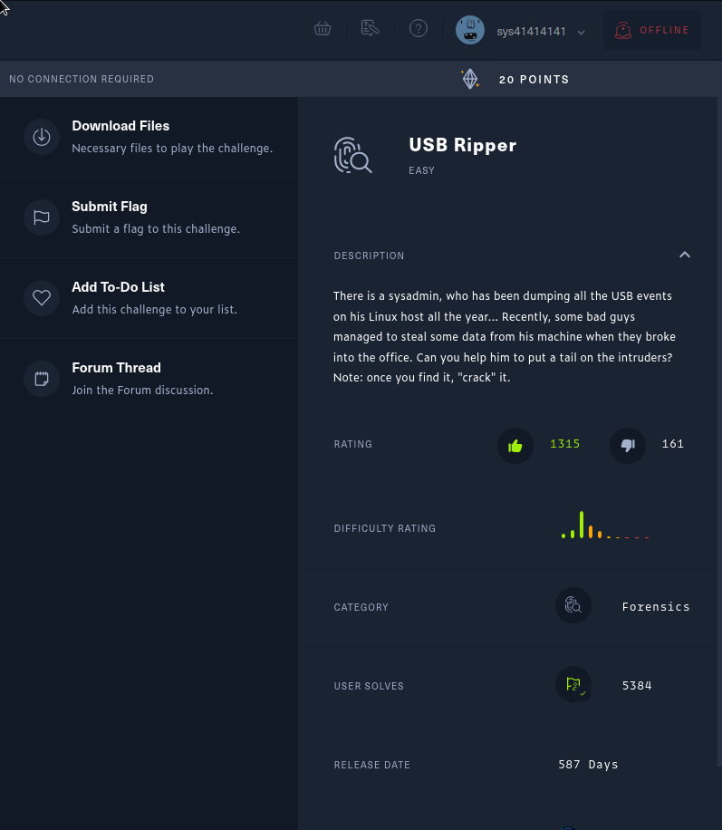

# HackTheBox [LAB-challenge]
## CHALLENGE NAME : USB Ripper

### Challenge Description

### Challenge Description

`
There is a sysadmin, who has been dumping all the USB events on his Linux host all the year... 
Recently, some bad guys managed to steal some data from his machine when they broke into the office. 
Can you help him to put a tail on the intruders? Note: once you find it, "crack" it.
`
