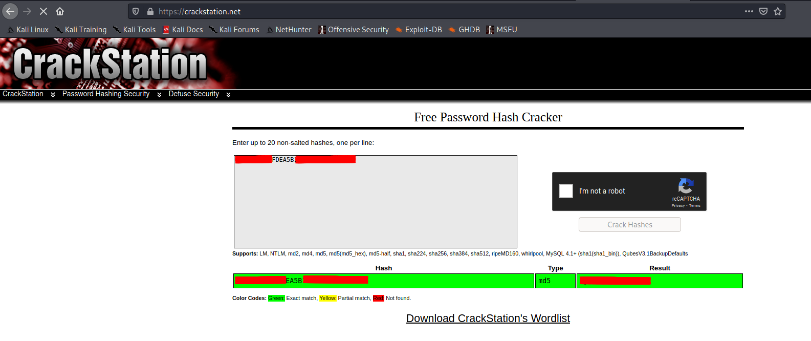

# HackTheBox [LAB-challenge]
## CHALLENGE NAME : USB Ripper  

## Writeup by **`Arijit-Bhowmick`** aka **`sys41414141`**


### Challenge Description

`
There is a sysadmin, who has been dumping all the USB events on his Linux host all the year... 
Recently, some bad guys managed to steal some data from his machine when they broke into the office. 
Can you help him to put a tail on the intruders? Note: once you find it, "crack" it.
`

## SOLUTION

Download the Challenge File. You are provided with a **zip** file names as `USB Ripper.zip`.
There are 2 files names as `auth.json` and `syslog` in the compressed file.
Decompress those files.

**The Serial numbers of Authorized devices are loged in `auth.json`.
In the file `syslog` there are the details of devices that are used in office machine**

Actually I don't have any knowledge about any tools used by **sys admin** to manage the login information.
I have seen the serial numbers that are listed in `auth.json` file,
and found that the serial number matches the serial numbers in `syslog` file.

### ASSUMPTION

1. As `syslog` file logs the information about devices that are pluged in the machine
then it might also log the **serial number** of unauthorized devices.

2. If the authorized serial numbers are listed in `auth.json` file,
then we can easily compare the **serial numbers**  from `syslog` file
with `auth.json` file and identify the serial of un-recognized device.

### SCRIPTING

As I am not aware of any inbuilt scripts or softwares for analyzing about these **log** files,
I started to write my own code.

The Code that is used to solve this challenge is:

```
# ARIJIT BHOWMICK [sys41414141]


file = open('usb-ripper/auth.json', "r")
file_content = file.read()
file.close()

sys_log_ = open('usb-ripper/syslog', 'r')
sys_log = sys_log_.readlines()
sys_log_.close()

checked_serial = []

def serial_checker(serial):

		
	global checked_serial
	global invalid_serials

	if (serial not in checked_serial):
		
		checked_serial+=[serial]
		if (serial not in file_content):
			
			print(f"Invalid Serial : {serial}")

			invalid_serials_file = open("invalid_serials.txt", "a")
			invalid_serials_file.write(serial+"\n")
			invalid_serials_file.close()

		else:
			pass

	else:
		pass


for line in sys_log:
	if ("SerialNumber: " in line) == True:

		serial_checker(line.split("SerialNumber: ")[1].replace("\n", ""))
	else:
		pass

print("""Serial Checking Completed

Invalid serials are noted in \'invalid_serials.txt\' file""")

```

### CODE DESCRIPTION :
This Code first read the `auth.json` file in plain text and store the text in **file_content** variable.
Then it reads the lines of `syslog` file and store the list of lines in **sys_log** variable.
Then a loop runs where it checks the `SerialNumber: ` string in each line of `syslog` file.

If it finds the matching string, then it get the serial number from that line and pass it to **serial_checker()**
function where it checks if the serial number is listed in **checked_serial** list

- If the serial number is not checked earlier then it will add the serial number in the **checked_serial** list and
check if it is listed in `auth.json` file.

    - If the serial number is not listed in `auth.json` file, then a file named `invalid_serials.txt` will 
    be created with the un-recognized serial number
    
    - If the serial number is listed in `auth.json` file, then it will **pass** the argument.
    
- If the serial number is checked earlier then it will **pass** the argument.

This process will continue until all the serial numbers from `syslog` will be checked.

At last all the un-recognized **Serial Numbers** will be listed in `invalid_serials.txt` file.


### After Running the script


## Cracking

Then I have used ***https://crackstation.net*** to crack the hash that is listed in `invalid_serials.txt` file.



At last the Flag of this challenge would be `HTB{mychemicalromance}`
